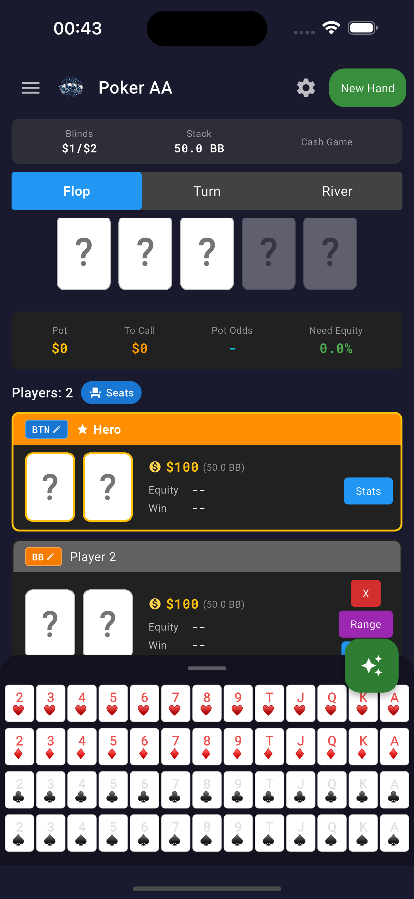
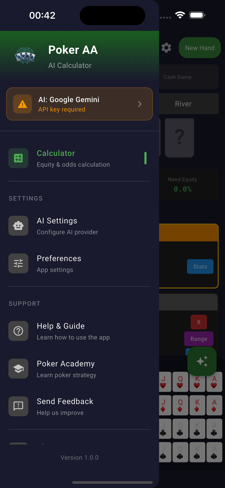
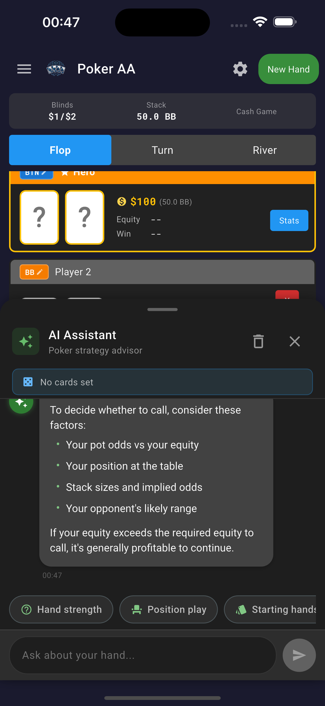
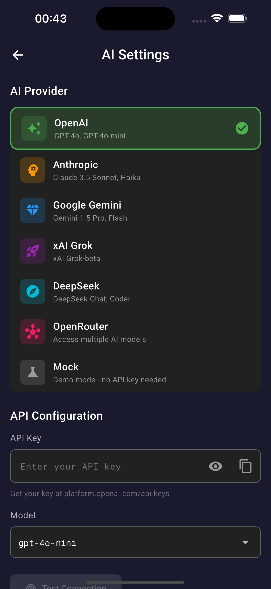

# Poker AI Calculator

A Flutter application for calculating poker hand equity and odds.

## Features

- Calculate hand equity against opponent ranges
- Support for Texas Hold'em
- Real-time odds calculation
- Clean and intuitive UI

## Getting Started

### Prerequisites

- Flutter SDK >= 3.0.0
- Dart SDK >= 3.0.0

### Installation

1. Clone the repository
```bash
git clone https://github.com/lugon/poker-ai-calculator.git
cd poker-ai-calculator
```

2. Install dependencies
```bash
flutter pub get
```

3. Run code generation (for Freezed/Riverpod)
```bash
dart run build_runner build --delete-conflicting-outputs
```

4. Run the app
```bash
flutter run
```

## Project Structure

```
lib/
├── main.dart
└── src/
    └── features/
        └── calculator/
            ├── domain/
            │   └── entities/
            └── presentation/
                ├── providers/
                ├── screens/
                └── widgets/
```

## Screenshots

| Main Calculator | Navigation |
|:---:|:---:|
|  |  |
| **Main calculator interface for equity calculations** | **App navigation and menu** |

| AI Assistant | AI Configuration |
|:---:|:---:|
|  |  |
| **AI-powered hand analysis assistant** | **Configure AI settings and preferences** |

## Tech Stack

- **State Management**: Riverpod
- **Code Generation**: Freezed, JSON Serializable
- **Architecture**: Clean Architecture

## License

This project is licensed under the MIT License - see the [LICENSE](LICENSE) file for details.
